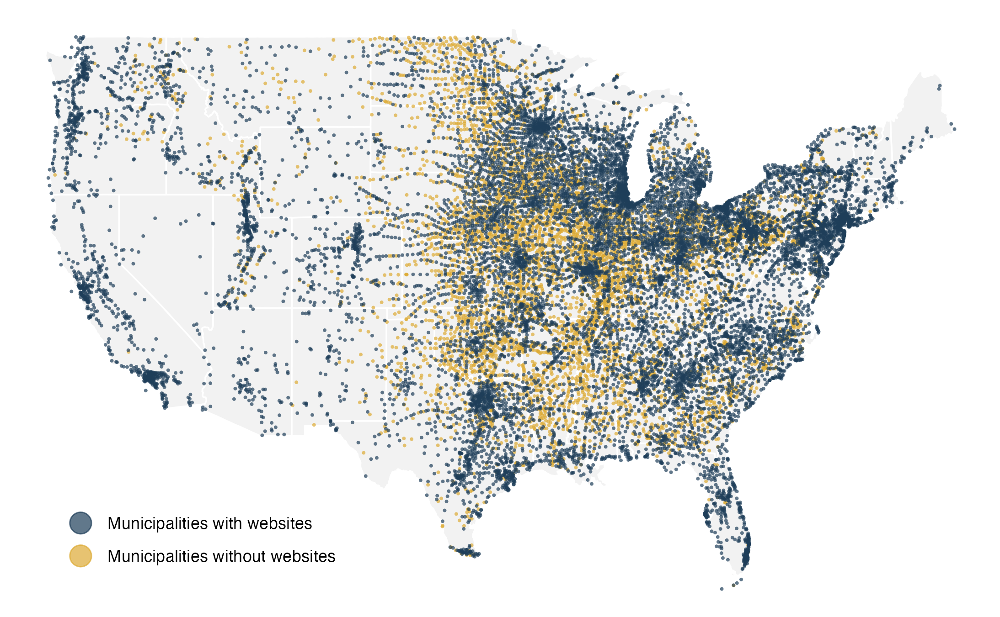

# UScityURL

UScityURL is a complete and manually verified dataset containing information on whether a municipality has an official website and, if so, what its web address is, of all 19,518 municipalities in the United States. A municipality is defined as a legally bounded entity with a local government, which is equivalent to an incorporated place in the US Census. Each entry of municipal web address was manually validated by two researchers who have expertise in urban and regional studies. 

  

## How to use this dataset

Using Google Custom Search API with this dataset allows researchers to systematically search self-defined keywords on municipal websites. The returned search results pinpoint where a certain topic is being discussed and can be used for further text-based analysis. Please run `how_to_use_tutorial.ipynb` to see detailed instructions and an example.

## License

This work is under a Creative Commons Attribution 4.0 International License (CC BY 4.0). Anyone is allowed to adapt, modify, and distribute this work with proper citation.

## Citation

Cite as: Cai, Meng, Huang, Huiqing, & Decaminada, Travis. (2023). caimeng2/UScityURL: v1.0 (v1.0) [Data set]. Zenodo. https://doi.org/10.5281/zenodo.7665175
